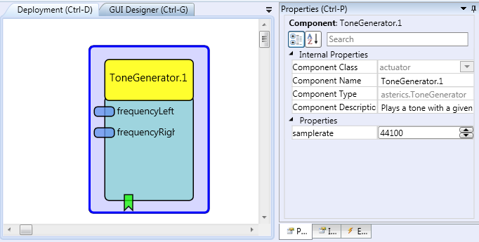

# ToneGenerator

### Component Type: Actuator (Subcategory: Audio and Voice)

This plugin generates a stereo sound.
The frequency of the tone for the left and right channel can be set individually.

  
ToneGenerator plugin

## Requirements

This software component requires an audio output device to percept the sound

## Input port Description

- **frequencyLeft\[double\]:** specifies the frequency of the tone on the left channel
- **frequencyRight\[double\]:** specifies the frequency of the tone on the right channel

## Properties

- **sampleRate\[integer\]:** sets the sampleRate of the tonegenerator

## Eventlistener Description

- **start:** starts the playback of the tones
- **stop:** stops the playback of the tones
