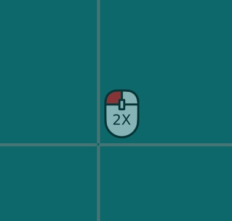

# Tooltip

Component Type: Actuator (Subcategory: Graphical User Interface)

The Tooltip component shows tooltips on a specific position on the screen. Tooltips are semi-transparent .png images, that are representing different actions like e.g. a double-click with the mouse or specific key-combinations for the keyboard. The main purpose of this plugin is to provide additional functions it in combination with a mouse control solution like CrosshairCursorControl or AngularCursorControl, but also can be used independently of mouse control.

The position of the Tooltips can be changed by properties and input ports (x/y) and they can be shown and selected by events. The plugin includes a default set of 7 .png images for common used tooltips in combination with mouse control, but alternative .png images can be used setting the property 'tooltipFolder'.

Fig. 1: Tooltip plugin

Fig. 2: Tooltip for double-click shown in a mouse control solution using the CrosshairCursorPlugin

Fig. 3: Default icon set of tooltips

## Input Port Description

- **x \[double\]:** The x-value of the center of the tooltip position (= e.g. mouse cursor position). The tooltip is always shown left/right, above/below of this center position, depending on the available space on the screen.
- **y \[double\]:** The y-value of the center of the tooltip position (= e.g. mouse cursor position).

## Output Port Description

- **tooltip \[string\]:** When a tooltip is selected, the filename of the chosen tooltip icon (without file extension) is sent to this output port.

## Event Listener Description

- **activateTooltips:** displays the first tooltip icon (see property 'tooltipStartIndex') and activates tooltip mode.
- **deactivateTooltips:** deactivates tooltip mode, if currently active.
- **nextTooltip:** navigates to next tooltip, if tooltip mode is currently active.
- **previousTooltip:** navigates to previous tooltip, if tooltip mode is currently active.
- **selectTooltip:** selects the currently shown tooltip and disables tooltip mode afterwards.

## Event Trigger Description

- **tooltipActivated:** This event is fired after the tooltip mode was activated.
- **tooltipDeactivated:** This event is fired after the tooltip mode was deactivated, either by event 'deactivateTooltip', by inactivity timeout of 'selectTime' or by navigating to an index without corresponding .png file.

## Properties

- **initialX \[boolean\]:** The initial x-value of the center of the tooltip position (= e.g. mouse cursor position). The tooltip is always shown left/right, above/below of this center position, depending on the available space on the screen.
- **initialY \[boolean\]:** The initial y-value of the center of the tooltip position (= e.g. mouse cursor position).
- **selectTime \[integer\]:** The time of inactivity (in milliseconds) after which the currently shown tooltip is selected. After selection the filename of the selected tooltip is sent to output port 'tooltip' and the tooltip mode is disabled. Use selectTime zero to deactivate automatic selection.
- **tooltipFolder \[integer\]:** Path of a folder (./relative file path from the ARE/data folder, e.g. 'pictures/tooltips') which contains the tooltip icons in .png format. The expected filenames are 1.png, 2.png, 3.png and so on. A set of seven (index 1-7) default tooltips is provided by default in the folder 'pictures/tooltips' (see Fig.3):  
  (1) mouse drag, (2) mouse double-click, (3) mouse right-click, (3) keys Ctrl+C, (4) keys Ctrl+V, (5) keys Ctrl+X, (6) keys Ctrl+A
- **tooltipStartIndex \[integer\]:** Index of the first tooltip to show, after tooltips are activated.
