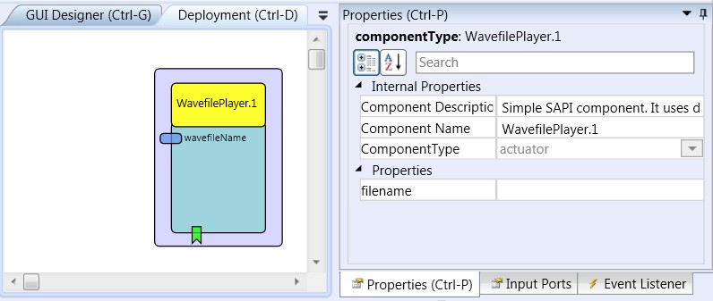

# Wavefile Player

### Component Type: Actuator (Subcategory: Audio and Voice)

This plugin plays a wave file specified in the properties on the platforms sound output.

  
WavefilePlayer plugin

## Input port Description

- **wavefileName\[string\]:** this port will change the property filename to the string on the input.
  Thus it is possible to have other plugins change the file to be played.

## Event Listener Description

- **Start:** An incoming event at this port initiates the playback of the wave file indicated in the property _filename_.
- **Stop:** An incoming event at this port stops the playback of the wave file indicated in the property _filename_.
- **VolumeUp:** An incoming event increases the volume of the current playback.
- **VolumeDown:** An incoming event decreases the volume of the current playback.

## Properties

- **filename\[string\]:** The value of this property specifies the file name of the wave file to be played.
  **Supports value suggestions from ARE (dynamic property)**
