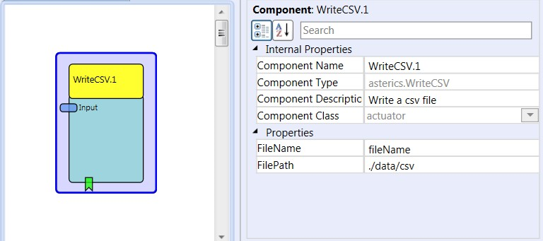

# {{$frontmatter.title}}

Component Type: Actuator (Subcategory: File System)

This plugin writes incoming strings into an .csv file.

The data gets live recorded, so it can be viewed simultaneously in an oscilloscope.

WriteCSV

## Event Listener Description

*   **StartWriting:** Creates a new file to save the data.
*   **StopWriting:** Stops a saving process.

## Input port Description

*   **Input\[string\]:** The string contains the data. Example of one string: "data1;data2;data3". To get data values and separators into this string, the StringExpander plugin can be used. After each string, a line separator (newline) is appended.

## Properties

*   **FileName\[string\]:** Specifies the name of the file (without extension), in which the data will be recorded. Current date and time information are added to the filename.
*   **FilePath\[string\]:** Defines the Path were the File shoud be saved (relative from the ARE folder). If not existing, the path will be created.