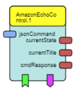

# AmazonEchoControl

Component Type: Processors (Subcategory: Home Control)

This plugin is based on the openHAB plugin, but is only used to control the [AmazonEchoControl binding][5] from openHAB.

The plugin controls the AmazonEchoControl binding from openHAB.
It is configured to interact directly with the binding. 

See the [openHAB documentation][1].

This component uses the provided REST API of openHAB to read and write the state of different nodes, called items within the openHAB system.


## Requirements

A functional openHAB installation, 
which is accessible via the web interface (the plugin connects via HTTP REST API). 
You can run either HTTP or HTTPS, in order to fulfill any security requirements. 

### Installation

To run openHAB without password authentication, start openHAB with this command:

#### Linux and macOS  

```sh
./start_debug.sh
``` 

#### Windows

in the openHAB folder, double click on 

```cmd
start_debug.bat
```

After installing and running openHAB, start the browser and use https://localhost:8080 for HTTP or https://localhost:8443 for HTTPS.

See the ([openHAB installation guide][3]).

#### Initial Setup of openHAB

Before this plugin can be used, the openHAB must be initialized and the AmazonEchoControl binding must be installed. The following steps, based on the [openHAB first-time setup][4], must be done

1. Select **Standard (recommended setup)**, this step can take a while
2. Select the **PAPER UI**
3. Go to **Add-ons** in the control panel and on Tab **BINDINGS** and search for **Amazon Echo Control Binding** and click install.
4. Go to **Configuration** and click on **Things** and create a new Amazon Echo Control Binding Thing.
5. Click on **Amazon Account** and accept it by pressing on the tick
6. After that, use this link to connect openHAB with your **Amazon Account** (http://localhost:8080/amazonechocontrol/).
7. Back in the **Configuration** menu click on **Things**, the account should be online.
8. If everything worked, go to **Inbox** and accept the two new **Things**.
9. The things will show up in the **Control** area.

if not, follow the instruction at: [openHAB: AmazonEchoControl-Binding][5]
 


## AmazonEchoControl Plugin



#### Input Port Description

*   **jsonCommand \[string\]:** Set a new state of an item, e.g. ```{"ItemSuffix": "player", "value": "PLAY"}```.  
The field itemSuffix represents the suffix (from the last ```_``` to the end of the item id) of an item only. The value represents the new state of the item. The itemsuffix has to be written lowercase and the value has to be written in uppercase. For a list of available items, see (http://localhost:8080/rest/items).
    
    * **Examples:**
    * ```{"ItemSuffix": "musicProviderId", "value": "SPOTIFY"}``` for changing the provider
    * ```{"ItemSuffix": "volume", "value": "50"}``` for changing the volume
    * ```{"ItemSuffix": "playMusicVoiceCommand", "value": "Yesterday from the Beatles"}``` for listening to a new song


#### Output Port Description

*   **currentState:** The current state of the item, which was changed with the latest **jsonCommand**.
*   **currentTitle:** The title of the current song playing.
*   **cmdResponse:** The response of the latest **jsonCommand**. Shows **OK** if the cmd was correct or **ERROR** if it was not (plus a more detailed error message)


#### Event Listener Description


#### Event Trigger Description

This plugin has two event triggers:

* **turnedOn:** Sent, when the music starts
* **turnedOff:** Sent, when the music is paused/stopped.

## Properties

*   **updaterate \[integer\]:** Time in milliseconds, which will ellapse between each status update. Default: 1s (1000ms)
*   **hostname \[string\]:** Hostname to connect to. It is possible to use a hostname, an IP adress or a FQDN
*   **port \[string\]:** Port of the openHAB installation. Defaults: 8080 for HTTP, 8443 for HTTPS. Please take care of any blocking firewall.
*   **protocol:** Protocol to connect to openHAB. Either http or https may be used (recommended: https).
*   **lazyCertificates \[boolean\]:** If this property is set, any SSL related certificate check will be removed for the given hostname. This affects the hole ARE.
*   **username \[string\]:** This property is used, if the HTTP basic authentication of openHAB is used. Provide the username here.
*   **password \[string\]:** This property is used, if the HTTP basic authentication of openHAB is used. Provide the password here.

## Additional hints

*   The model will stop with an error message, if one of the item names in the properties is not found.
*   There is no feedback for checking a successful state change. E.g.: if your write to a read-only item (temperature sensor), nothing will happen
*   Use the _lazyCertificates_ property with care, it will disable a major part of the SSL handshaking for the whole Java session. It should be limited to the given hostname only, but without warranty.
*   The username/password combination from the properties is saved in PLAINTEXT in the model file, so handle it with care.

[1]: https://www.openhab.org/docs/
[2]: https://github.com/openhab/openhab/wiki
[3]: https://www.openhab.org/docs/installation/
[4]: https://www.openhab.org/docs/tutorial/1sttimesetup.html
[5]: https://www.openhab.org/addons/bindings/amazonechocontrol/