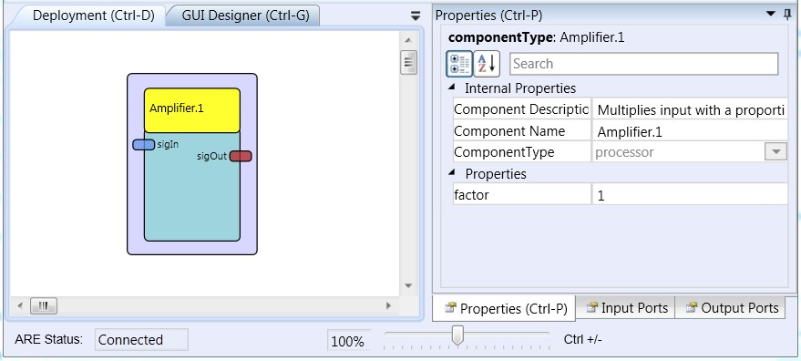

# Amplifier

Component Type: Processor (Subcategory: Basic Math)

This component takes an input and multiplies it with a gain factor set in the properties. It can be used to amplify or reduce signal values or to invert them.

Amplifier plugin

## Input Port Description

- **sigIn \[double\]:** The input value to be amplified.

## Output Port Description

- **sigOut \[double\]:** The amplified output value.

## Properties

- **factor \[double\]:** The gain factor that inputs are multiplied with.
