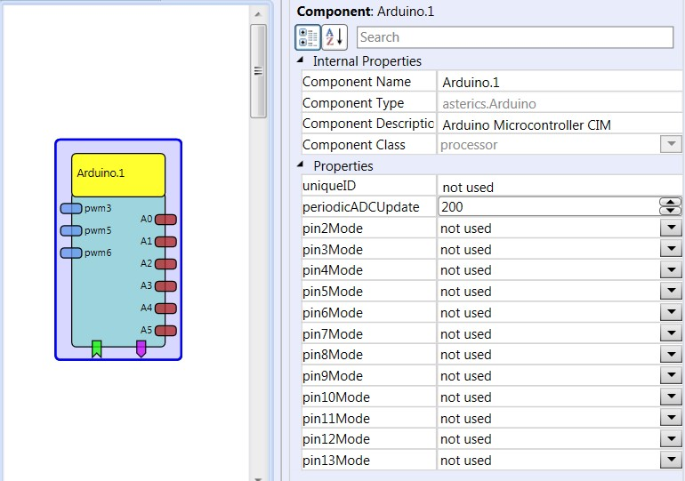

##

## Arduino

# Arduino

### Component Type: Processors (Subcategory: Microcontroller Interface)

The Arduino component provides an interface to the Arduino Uno microcontroller and makes available analog inputs and digital inputs and outputs.

  
Arduino plugin

## Requirements

An Arduino UNO microcontroller board has to be connected to an USB port. The Arduino CIM firmware must have been downloaded into the Arduino to communicate via the CIM protocol with the Arduino component.

  
Arduino UNO board

## Input Port Description

- **pwm3 \[integer\]:** PWM channel 3, output value (range: 0-255). The output signal depends on the mode (PWM or servo PWM)
- **pwm5 \[integer\]:** PWM channel 5, output value (range: 0-255). The output signal depends on the mode (PWM or servo PWM)  
  **Warning:**Due to hardware limitations, either PWM or IO mode is available for pin 5 AND 6. It is not possible to use these pins individually!
- **pwm6 \[integer\]:** PWM channel 6, output value (range: 0-255). The output signal depends on the mode (PWM or servo PWM)  
  **Warning:**Due to hardware limitations, either PWM or IO mode is available for pin 5 AND 6. It is not possible to use these pins individually!

## Output Port Description

- **A0 - A5 \[integer\]:** The readings of the 6 analog channels of the Arduino (0-1023)

## Event Listener Description

- **setPin2 - setPin13:** An incoming event will set the corresponding digital output pin on the Arduino to high level (5V)
- **clearPin2 - clearPin13:** An incoming event will set the corresponding digital output pin on the Arduino to low level (0V)

## Event Trigger Description

- **pin2ChangedToLow - pin13ChangedToLow:** This event is triggered if the corresponding input pin on the Arduino switches from high to low level (connected to 0V)
- **pin2ChangedToHigh - pin13ChangedToHigh:** This event is triggered if the corresponding input pin on the Arduino switches from low to high level (connected to 5V)

## Properties

- **uniqueID \[integer\]:** If more than one Arduino CIM is used, this property allows the identification of the module. (dynamic property)
- **periodicADCUpdate \[integer\]:** This property defines how often the ADC values are measured and put out on the ports A0-A5 (0=disable ADC)
- **pin2Mode - pin13Mode \[integer\]:** This property defines the mode of the Arduino Pins. The value can be selected via a ComboBox. Possible selections are:
  - not used
  - Input without pullup resistor
  - Input with pullup resistor
  - output, default low
  - output, default high
  - PWM servo (PWM for servo driving, 1-2ms pulse), available only on pin 3,5 and 6
  - 500Hz PWM (normal 0-100% PWM), available only on pin 3,5 and 6
