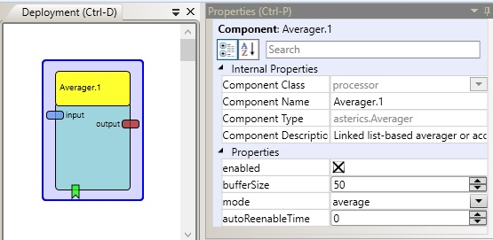

# Averager

Component Type: Processor (Subcategory: Basic Math)

The averager component takes an input stream and forwards the average of certain amount of buffered last inputs. The size of the buffer can be set via a property. The component can be used to eliminate spikes in an input data stream. Furthermore the unit can also be used as an accumulator which accumulates all inputs within a certain time interval.

Averager plugin

## Input Port Description

- **input \[double\]:** This port reads the inputs to be averaged.

## Output Port Description

- **output \[double\]:** This port provides the current average of the buffered inputs.

## Event Listener Description

- **enablePlugin:** Enables the functionality of this plugin.
- **disablePlugin:** Disables the functionality of this plugin. New values aren't accumulated anymore and no output is sent to the output port. If property autoReenableTime set, the plugin is automatically re-enabled after the time defined by this property. Generally disabling is delayed until the buffer of values is full, preventing any startup glitches.

## Properties

- **enabled \[boolean\]:** if true (default), the plugin is enabled, if false the plugin does nothing. Generally disabling is delayed until the buffer of values is full, preventing any startup glitches.
- **mode \[integer\]:** Denotes the operating mode of the unit, three modes are available:
  - _average:_ unit performs averaging calculations and emits double values average with integer.
  - _output:_ unit performs calculations and rounds result to integer.
  - _accumulate:_ unit accumulates inputs for certain amount of time.
- **bufferSize \[integer\]:** Specifies the size of the buffer in the averaging modes or the amount of milliseconds to accumulate in the accumulator mode.
- **autoReenableTime \[integer\]:** Time in ms, after the plugin automatically re-enables itself after being disabled. Set to zero (default) to deactivate this functionality (never auto re-enable).
