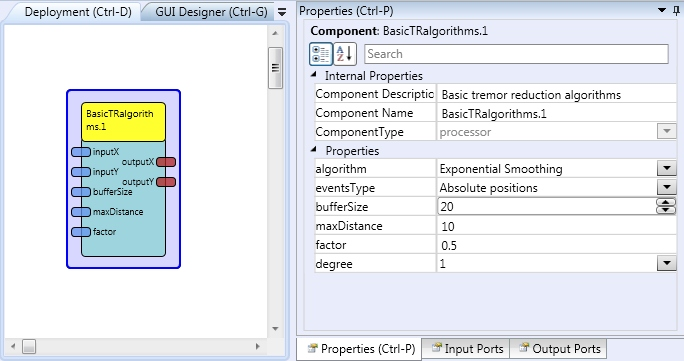

# Basic Tremor Reduction algorithms

Component Type: Processor (Subcategory: Singal Shaping)

This plugin contains three algorithms for user hand tremor reduction: Arithmetic Mean, Outlier Reduction and Exponential Smoothing. The Arithmetic Mean algorithm calculates the cursor position as an average of the past n cursor positions. N is defined by the bufferSize parameter. The Outlier Reduction algorithm keeps the maximum distance between two followed cursor positions. The maximum distance is defined by the maxDistance parameter. If the distance between two cursor positions is greater than maxDistance, it is reduced to the value of maxDistance. The Exponential Smoothing algorithm implements the [Exponential smoothing][1] technique. The factor parameter defines the Exponential Smoothing and the degree parameters define the degree of the equation.

Basic Tremor Reduction algorithms plugin

## Input Port Description

*   **inputX \[integer\]:** Input mouse X position.
*   **inputY \[integer\]:** Input mouse Y position.
*   **bufferSize \[integer\]:** The new buffer size value for the Arithmetic Mean algorithm.
*   **maxDistance \[double\]:** The new maximum distance value for the Outlier Reduction algorithm.
*   **factor \[double\]:** The new factor value for Exponential Smoothing algorithm.

## Output Port Description

*   **outputX \[****integer****\]:** Output mouse X position.
*   **outputY \[****integer****\]:** Output mouse Y position.

## Properties

*   **algorithm \[integer\]:** Defines the algorithm used for the tremor reduction.
*   **eventsType \[integer\]:** Defines if the mouse coordinates are absolute or relative.
*   **bufferSize \[integer\]:** The buffer size value for the Arithmetic Mean algorithm.
*   **maxDistance \[double\]:** The maximum distance value for the Outlier Reduction algorithm.
*   **factor \[double\]:** The factor value for Exponential Smoothing algorithm.
*   **degree \[integer\]:** The degree of the equation for Exponential Smoothing algorithm.

[1]: http://en.wikipedia.org/wiki/Exponential_smoothing