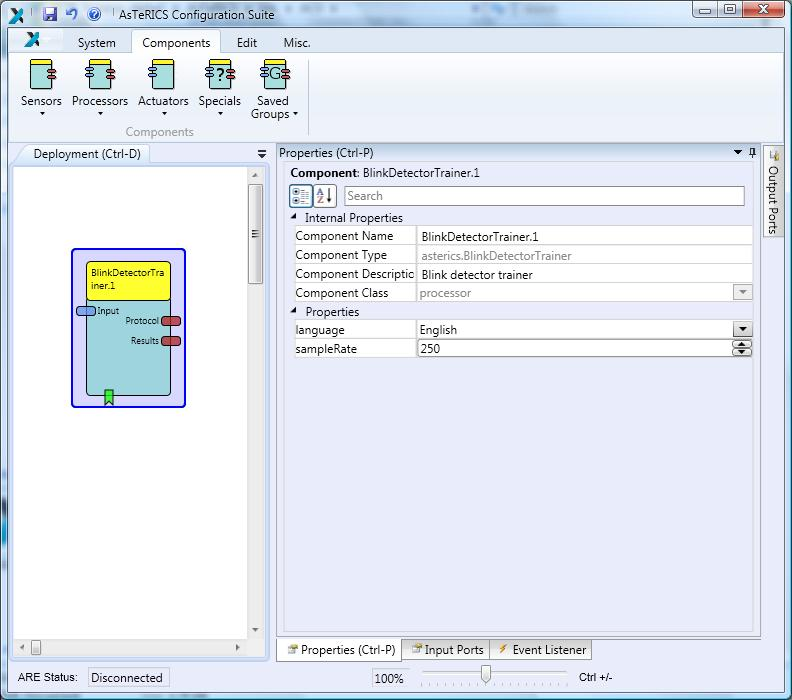

# Blink Detector Trainer

Component Type: Processor (Subcategory: DSP and Feature Detection)

This component calculates the maxThreshold, minThreshold, BlinkLength and DoubleBlinkSeparation customized properties of the [Blink Detector][1] plugin for each specific subject. For a description of the meaning of these properties, please see [Blink Detector][2]. The training of the system consists on asking the subject to follow a protocol. This protocol consists on a series of 5 simple blinks and 5 double blinks. Note that the subject can perform only **one** simple (or double) blink each time the protocol indicates so through its Protocol port. When the protocol finishes, the results show up through the Results output port.

Blink Detector plugin

## Requirements

The input signal shall correspond to a 250-Hz sampled electro-oculogram signal, i.e., an output port of the [Enobio][3] component when the corresponding electrode is placed on the user's forehead.

## Input Port Description

- **input \[integer\]:** Input values that correspond to a 250-Hz sampled electro-oculogram signal.

## Output Port Description

- **Protocol \[string\]:** Actions to be performed by the user. Note that the user must perform just one blink (or double blink) each time the corresponding message is delivered through this port.
- **Results \[string\]:** Final parameters calculated for the specific subject. They will delivered when the protocol has finished.

## Event Listener Description

- **StartProtocol \[integer\]:** Starts the training protocol. The actions to be performed by the subject will be delivered through the Protocol port.
- **StopProtocol:** Stops the training protocol.

## Properties

- **sampleRate \[integer\]:** Sample rate of the input signal in Hertz.
- **language \[list\]:** Language of the messages thrown through the Protocol port while the protocol is running. The user can chose English or Spanish.

[1]: ../processors/BlinkDetector.htm
[2]: ../processors/BlinkDetector.htm
[3]: ../sensors/Enobio.htm
