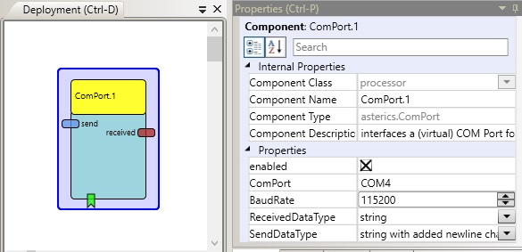

# ComPort

Component Type: Processor (Subcategory: Communication)

The ComPort plugin can be used to send and receive data from serial devices (e.g. microcontrollers/embedded devices/wireless links etc.) via a COM port or virtual COM port. The plugin provides support for different data formats of serial communication, e.g. string or binary

COMPort plugin

## Input Port Description

- **send \[string\]:** string which will be sent to the microcontroller / embedded module

## Output Port Description

- **received \[string\]:** string which has been received (was sent from the microcontroller / embedded module)

## Event Listener Description

- **enablePlugin:** Enables the functionality of this plugin.
- **disablePlugin:** Disables the functionality of this plugin. Any open COM port is closed and no new values are received.

## Properties

- **enabled \[boolean\]:** If true (default), the plugin is enabled, if false the plugin does nothing and doesn't attempt to open the given COM port.
- **ComPort \[string\]:** Defines the COM Port of the target serial device. e.g. COM0
- **BaudRate \[integer\]:** Defines the Baudrate for the communication. It must match the baudrate of the target device
- **ReceivedDataType \[combobox selection\]:**can be used to indicate other data type like binary integer type etc. (currently, only string is supported)
- **SendDataType \[combobox selection\]:**can be used to indicate data type for sending (currently, string is supported and a selectable termination character can be added)
