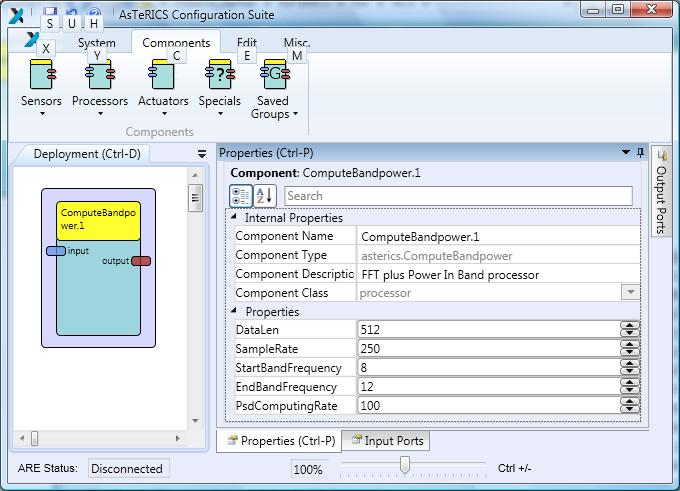

# Compute Bandpower

Component Type: Processor (Subcategory: DSP and Feature Detection)

This component computes the power that an input signal has in a specific frequency band. The plugin stores as many values as the DataLen property indicates before providing a new value in the output port. This solution is based on the FFT so only the bins corresponding to the specified band are considered. This approach removes the contribution of the out-band frequencies to the final value. This approach improves the power output of the filter plugin which uses the filtered signal for computing the output value so the frequencies out of the pass band contributes to the final value since the filter is implemented as FIR filter with a finite number of coefficients so the frequency response will not never be perfect.

Compute Bandpower plugin

## Requirements

The values in the input port shall correspond to a time series.

## Input Port Description

*   **input \[double\]:** Input port for the values of time series which power in band is computed.

## Output Port description

*   **output \[double\]:** Output of the value that corresponds to the power of the signal present in the last DataLen samples. If the input signal is expressed in volts, then the output is expressed in squared volts.

## Properties

*   **DataLen \[integer\]:** Defines the length of the time series over which the band power computation is performed. Only power of two values are allowed for this property.
*   **SampleRate \[integer\]:** Defines the sample rate of the input time series. It is defined in samples per second.
*   **StartBandFrequency \[integer\]:** Defines the beginning of the band to be analysed. It is defined in Hertz.
*   **EndBandFrequency \[integer\]:** Defines the end of the band to be analysed. It is defined in Hertz.