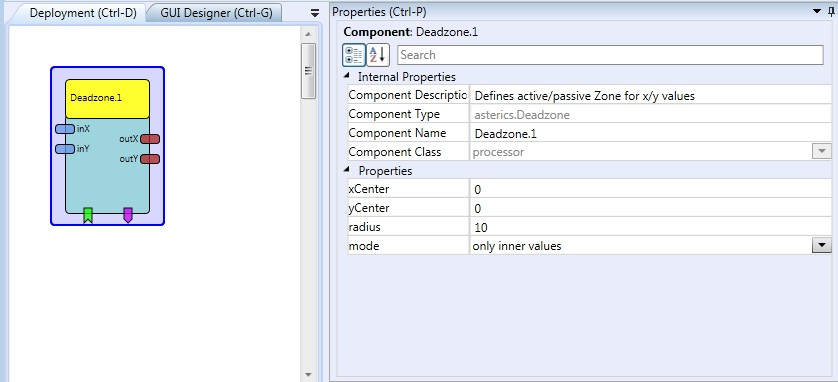

# Deadzone

### Component Type: Processor (Subcategory: Signal Shaping)

The purpose of this component is to define active and passive areas (zones) for one- or two dimensional sensor values. This function could also be called "resting zone" or "centerzone". It can be useful for example when a mouse pointer should not move before a certain value of a sensor (displacement of an analogue sensor, strength of activity) is reached.

  
Deadzone plugin

## Input Port Description

- **inX \[double\]:** Input of x values. **This input port supports synchronization**
- **inY \[double\]:** Input of y values. **This input port supports synchronization**
- **radius \[double\]:** The radius of the active/passive zone around the centre point.

## Output Port Description

- **outX \[double\]:** Output of modified x values.
- **outY \[double\]:** Output of modified y values.

## Event Listener Description

- **setCenter:** An incoming event stores the current x- and y- input values to represent the centre (It defines them as offset values). This can be useful for sensor calibration because it defines the "baseline" or resting position.

## Event Trigger Description

- **enterZone:** This event is triggered when the x or x- and y- values enter the specified radius around the centre.
- **exitZone:** This event is triggered when the x or x- and y- values leave the specified radius around the centre.

## Properties

- **xCenter \[double\]:** This value defines the x- position of the centre (the middle of the active/passive zones).
- **yCenter \[double\]:** This value defines the y- position of the centre (the middle of the active/passive zones).
- **radius \[double\]:** The radius of the active/passive zone around the centre point.
- **mode \[integer\]:** Selects the mode of operation of the centerzone component, following modes are available:
  - _"only inner values":_ x- and y- values are passed to the output ports only if the distance to the centre is lower than the given radius.
  - _"only outer values":_ x- and y- values are passed to the output ports only if the distance to the centre is greater than the given radius.
  - _"deadzone":_ x- and y- values are passed to the output ports only if the distance to the center is lower than the given radius, and additionally a correction of the values is performed so that they start with 0 when leaving the inner zone. This is useful for defining a "deadzone" for sensor values, where an inactive area shall be provided and no sudden acceleration is desired when leaving this inactive area.
