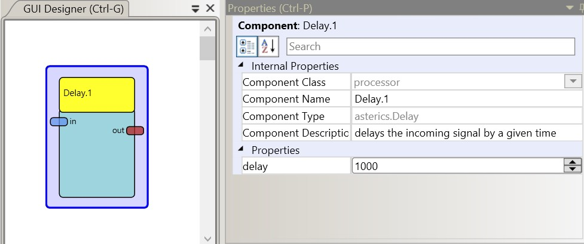

# Delay

Component Type: Processor (Subcategory: Basic Math)

This plugin passes received double values after a defined delay.

Delay plugin

## Input Port Description

- **in (double):** Input port for the incoming signal.

## Output Port Description

- **out (double):** Output port for the delayed signal.

## Properties

- **delay \[integer\]:** Delay between input and output signal (in milliseconds).
