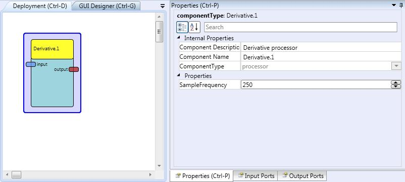

# Derivative

Component Type: Processor (Subcategory: Basic Math)

This component computes the first derivative operation of the input signal by using an approximation by a numerical differentiation method using five points. Due to the fact that the component takes into consideration the previous four samples plus the current one, it will output the derivative value corresponding to the centre sample of the five ones. It means two samples earlier from the one that is received in the input port.

Derivative plugin

## Input Port Description

- **input \[double\]:** Input port for the signal to be derived.

## Output Port Description

- **output \[double\]:** Output port of the first derivative of the input signal. The output values present a delay of two samples because of the reason given in the general description.

## Properties

- **SampleFrequency \[integer\]:** Defines the frequency which the input signal is sampled, so the distance between two consecutive samples, which is used by the component, is defined.
