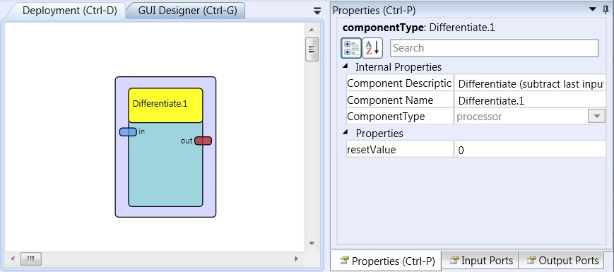

# Differentiate

Component Type: Processor (Subcategory: Basic Math)

The differentiate component outputs the difference of the previous to the current input value on the output port. This functionality can be considered as a simplified implementation of the derivative component.

Differentiate plugin

## Input Port Description

- **in \[double\]:** Input port for signal.

## Output Port Description

- **out \[double\]:** Output of difference value.

## Properties

- **resetValue \[double\]:** The value that is used in the first difference calculation after start.
