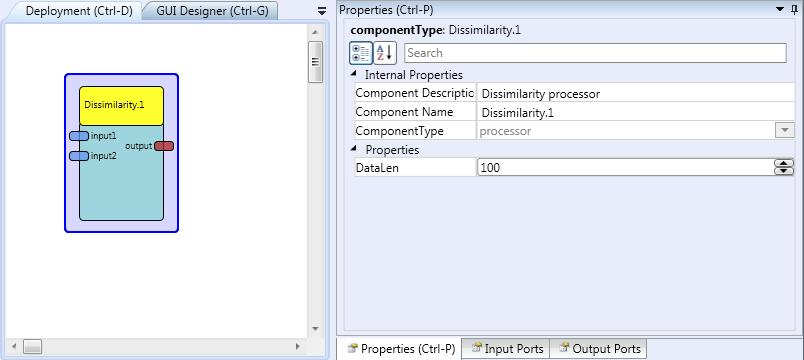

# Dissimilarity

Component Type: Processor (Subcategory: DSP and Feature Detection)

This component computes the Euclidean distance between two input vectors. The component stores the input values from both input ports until DataLen values have been received, then the computation is performed and sent to the output port.

Dissimilarity plugin

## Input Port Description

*   **input1 \[double\]:** Input port for the first signal.
*   **input2 \[double\]:** Input port for the second signal.

## Output Port Description

*   **output \[double\]:** Output port for the dissimilarity computation. A value is provided every time DataLen samples arrive to the input ports.

## Properties

*   **DataLen \[integer\]:** Defines the length of the signals over which the dissimilarity is computed.