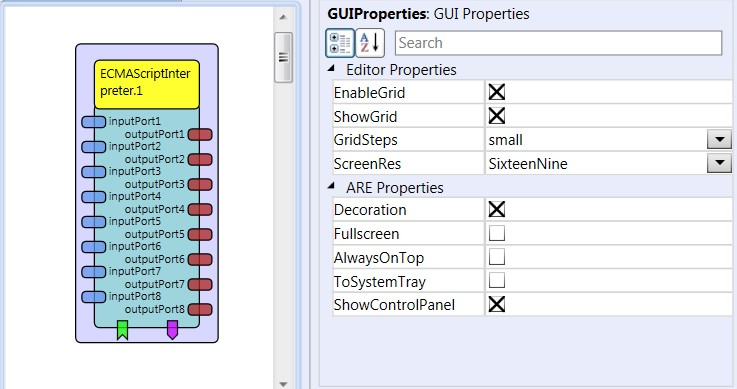

# ECMAScriptInterpreter

Component Type: Processor (Subcategory: Scripting)

This component is a general purpose processor that can relays the input and incoming events to a script compatible to the ECMA script specification (e.g. JavaScript). The script is specified by the property scriptname. If the property is left empty, the component will load the file "script.js" from local storage. If this file does not exist, the component will generate the file in local storage and fill it with a default "pass-through" script.

There are certain constraints for the script:

- the script has to contain an object named scriptclass.
- the object has to implement a method dataInput(input_index, input_data)
- the object has to implement a method eventInput(event_index)

The script is provided with the following external variables:

- output: an array of size 8 representing 8 IRuntimeOutputPorts
- eventout: an array of size 8 representing 8 IRuntimeEventTriggererPorts
- property: an array of size 8 holding strings with the property inputs from the components property fields

The sendData method of the output variables has to be called with a string. If necessary this needs to be converted into a Java string, this can be done like this:

```
str = new java.lang.String(in\_data);
output\[in\_nb\].sendData(str.getBytes());
```

For more information please see a demo script in the plugin source code!

  
ECMAScriptInterpreter plugin

## Input Port Description

- **inputPort1 - inputPort8 \[string\]:** input ports for script parameters

## Output Port description

- **outputPort1 - outputPort8 \[string\]:** output ports for script results

## Event Listener Description

- **elpPort1 - elpPort8:** 8 event listener ports which can be used by the script code.

## Event Trigger Description

- **etpPort1 - elpPort8:** 8 event trigger ports which can be used by the script code.

## Properties

- **scriptname \[string\]:** a valid filename of an ECMA-compatible script (e.g. Javascript) which shall be interpreted
- **value1 - value8 \[string\]:** 8 properties which can be used by the script.
