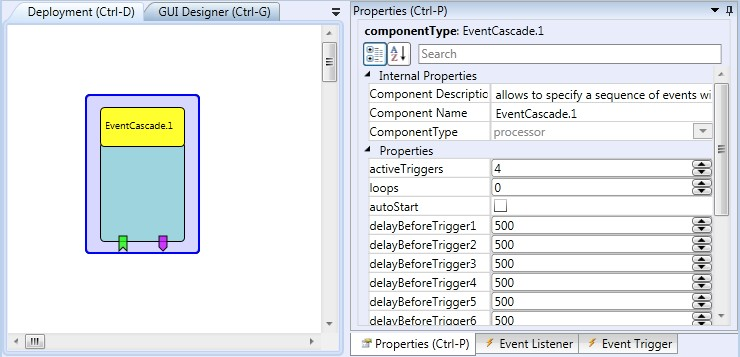

# {{$frontmatter.title}}

Component Type: Processor (Subcategory: Event and String Processing)

The EventCascade component can be used to generate a sequence (or loops) of events with selectable delay times. The sequence can be started and stopped via incoming events.

EventCascade plugin

## Event Listener Description

- **nextEvent:** Triggers the next event in the event cascade (with wrap-around)
- **previousEvent:** Triggers the previouse event in the event cascade (with wrap-around)
- **startCascade:** Starts the event sequence
- **startCascade:** Stops the event sequence
- **reset:** Sets the next event number to zero (first in the sequence)

## Event Trigger Description

- **trigger1 - trigger15:** The available event trigger outputs

## Properties

- **activeTriggers \[integer\]:** How many event triggers are active (defines the wrap-around)
- **loops \[integer\]:** How many loops will be performed before the event sequence stops (0=endless loop)
- **autoStart \[boolean\]:** Defines if the event cascade will be automatically started at model startup
- **delayBeforeTrigger1 - delayBeforeTrigger15\[integer\]:** Delay time before the corresponding trigger event is created
