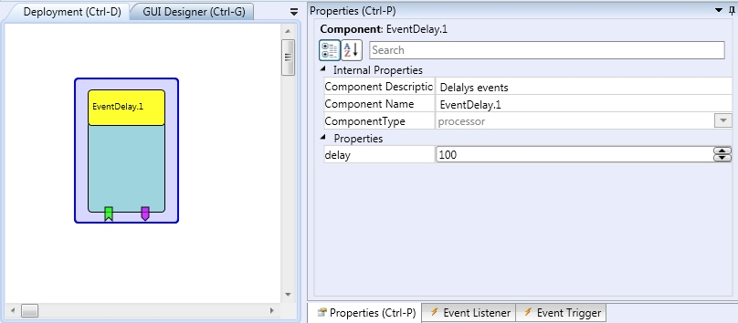

# {{$frontmatter.title}}

Component Type: Processor (Subcategory: Event and String Processing)

This plugin passes received events after a defined delay.

EventDelay plugin

## Event Listener Description

- **input:** Input port for the events.

## Event Trigger Description

- **output** **:** Output port for events.

## Properties

- **delay \[integer\]:** Delay between input and output event (in milliseconds).
