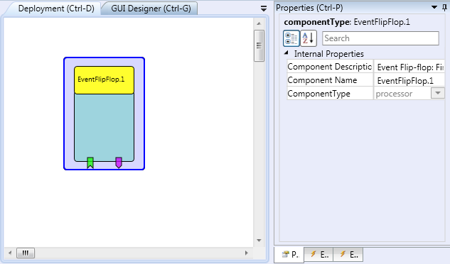

# {{$frontmatter.title}}

Component Type: Processor (Subcategory: Event and Signal Processing) This component stores the state, driven by an event. When the event-in event is received and the internal status is 1, event-out1 is fired and the internal status set to 2. When the event-in event is received and the internal status is 2, event-out2 is fired and the internal status set to 1.

Event Flip Flop plugin

## Event Listener Ports

*   **event-in:** Event input to change the state of the flip-flop and fire an out-event.
*   **selectOut1:** selects state 1 (event-out1 trigger port will send the next incoming event)
*   **selectOut2:** selects state 2 (event-out2 trigger port will send the next incoming event)

## Event Trigger Description

*   **event-out1:** Event fired, if event-in received and stored state is 1.
*   **event-out2:** Event fired, if event-in received and stored state is 2.

## Properties

No Properties.