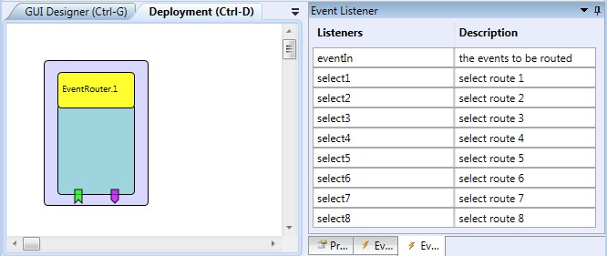

# EventRouter

This component allows routing incoming events to one out of 8 output (trigger) event ports.

### Component Type: Processor (Subcategory: Event and Signal Processing)

  
Event Router plugin

## Event Listener Description

- **eventIn:** The incoming events to be routed.
- **select1-select8:** incoming events on these listener ports select one of the 8 trigger output ports for routing the events of the eventIn port

## Event Trigger Description

- **eventOut1-eventOut8:** 8 event trigger ports where the event entering the listener port eventIn can be routed to.

## Properties

No Properties.
