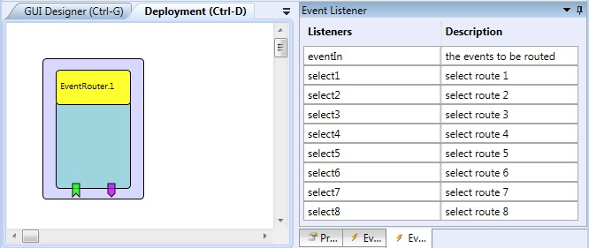

# EventRouter

Component Type: Processor (Subcategory: Event and Signal Processing)

This component allows routing up to 6 incoming events to one of 8 corresponding output (trigger) event ports.

Event Router plugin

## Event Listener Description

*   **eventIn1-6:** The incoming events to be routed.
*   **select1-select8:** selects one of the 8 corresponding event routes (trigger output ports) events entering the eventIn ports
*   **selectNext:** selects the next event route
*   **selectPrevious:** selects the next event route

## Event Trigger Description

*   **eventOut1-eventOut8:** 8 event trigger ports where the events entering the listener port eventIn can be routed to.
*   **eventOut2\_1-eventOut2\_8:** 8 event trigger ports where the events entering the listener port eventIn2 can be routed to.
*   **eventOut3\_1-eventOut3\_8:** 8 event trigger ports where the events entering the listener port eventIn3 can be routed to.
*   **eventOut4\_1-eventOut4\_8:** 8 event trigger ports where the events entering the listener port eventIn4 can be routed to.
*   **eventOut5\_1-eventOut5\_8:** 8 event trigger ports where the events entering the listener port eventIn5 can be routed to.
*   **eventOut6\_1-eventOut6\_8:** 8 event trigger ports where the events entering the listener port eventIn6 can be routed to.

## Properties

*   **activeRoutes (integer):** number of active routes (relevant for the selectNext and selectPrevious functions and the wrapAround feature)
*   **wrapAround (boolean):** if selected selectNext srats again at the first route when the last active route was reached, and selectPrevious continues at the last active route when triggered at the first route.