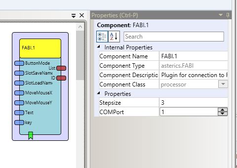

# FABI

Component Type: Processor (Subcategory: Microcontroller Interface)

This component provides an interface for a FABI controller and enables the programming process. It is possible to configure the buttons which are connected to the FABI controller and store the set to the built in EEPROM.

FABI plugin

## Requirements

The Plugin requires a FABI2.0 compatible Version as well as the right COM Port. The Baudrate is predefined at 9600 Baud.

## Input Port Description

*   **ButtonMode \[integer\]:** Number of the button
*   **SlotSaveName \[string\]:** Name of the slot to save the set of modes
*   **SlotLoadName \[string\]:** Name of the slot to load the set of modes
*   **MoveMouseX \[integer\]:** Number of pixels to move the mouse in X direction (right)
*   **MoveMouseY \[integer\]:** Number of pixels to move the mouse in Y direction (down)
*   **Text \[string\]:** Text for the KeyWrite command
*   **key \[string\]:** Text for the KeyPress command  
    (e.g. AT KP KEY\_UP presses the "Cursor-Up" key, AT KP KEY\_CTRL KEY\_ALT KEY\_DELETE presses all three keys)  
    supported key identifiers for key press command (AT KP):  
    
    					KEY\_A   KEY\_B   KEY\_C   KEY\_D    KEY\_E   KEY\_F   KEY\_G   KEY\_H   KEY\_I   KEY\_J    KEY\_K    KEY\_L
    					KEY\_M   KEY\_N   KEY\_O   KEY\_P    KEY\_Q   KEY\_R   KEY\_S   KEY\_T   KEY\_U   KEY\_V    KEY\_W    KEY\_X 
    					KEY\_Y   KEY\_Z   KEY\_1   KEY\_2    KEY\_3   KEY\_4   KEY\_5   KEY\_6   KEY\_7   KEY\_8    KEY\_9    KEY\_0
    					KEY\_F1  KEY\_F2  KEY\_F3  KEY\_F4   KEY\_F5  KEY\_F6  KEY\_F7  KEY\_F8  KEY\_F9  KEY\_F10  KEY\_F11  KEY\_F12	
    					
    					KEY\_RIGHT   KEY\_LEFT       KEY\_DOWN        KEY\_UP      KEY\_ENTER    KEY\_ESC   KEY\_BACKSPACE   KEY\_TAB	
    					KEY\_HOME    KEY\_PAGE\_UP    KEY\_PAGE\_DOWN   KEY\_DELETE  KEY\_INSERT   KEY\_END	  KEY\_NUM\_LOCK    KEY\_SCROLL\_LOCK
    					KEY\_SPACE   KEY\_CAPS\_LOCK  KEY\_PAUSE       KEY\_SHIFT   KEY\_CTRL     KEY\_ALT   KEY\_RIGHT\_ALT   KEY\_GUI 
    					KEY\_RIGHT\_GUI
    				
    

## Output Port Description

*   **List \[string\]:** Lists the slots stored in the EEPROM of the FABI controller
*   **ID \[string\]:** Shows the ID of the FABI version

## Event Listener Description

*   **ID :** identification string will be returned (e.g. "FABI Version 2.0")  
    Corresponding FABI command is : "AT ID"
*   **ButtonMode :** button mode setting for a button (e.g. AT BM 2 -> next command defines the new function for button 2)  
    Corresponding FABI command is : "AT BM num"
*   **ClickLeft :** click left mouse button  
    Corresponding FABI command is : "AT CL"
*   **ClickRight :** click right mouse button  
    Corresponding FABI command is : "AT CR"
*   **ClickDoubleLeft :** click double with left mouse button  
    Corresponding FABI command is : "AT CD"
*   **ClickMiddle :** click middle mouse button  
    Corresponding FABI command is : "AT CM"
*   **PressLeft :** press/hold the left mouse button  
    Corresponding FABI command is : "AT PL"
*   **PressRight :** press/hold the right mouse button  
    Corresponding FABI command is : "AT PR"
*   **PressMiddle :** press/hold the middle mouse button  
    Corresponding FABI command is : "AT PM"
*   **ReleaseLeft :** release the left mouse button  
    Corresponding FABI command is : "AT RL"
*   **ReleaseRight :** release the right mouse button  
    Corresponding FABI command is : "AT RR"
*   **ReleaseMiddle :** release the middle mouse button  
    Corresponding FABI command is : "AT RM"
*   **WheelUp :** move mouse wheel up  
    Corresponding FABI command is : "AT WU"
*   **WheelDown :** move mouse wheel down  
    Corresponding FABI command is : "AT WD"
*   **MoveMouseX :** move mouse in x direction (e.g. AT X 4 moves 4 pixels to the right)  
    Corresponding FABI command is : "AT MX num"
*   **MoveMouseY :** move mouse in y direction (e.g. AT Y -10 moves 10 pixels up)  
    Corresponding FABI command is : "AT MY num"
*   **KeyWrite :** keyboard write text (e.g. AT KW Hello! writes "Hello!")  
    Corresponding FABI command is : "AT KW text"
*   **KeyPress :** key press: press/hold all keys identified in text (e.g. AT KP KEY\_UP presses the "Cursor-Up" key, AT KP KEY\_CTRL KEY\_ALT KEY\_DELETE presses all three keys) The possible KeyPress commands are described in detail at the input port "key"!  
    Corresponding FABI command is : "AT KP text"
*   **KeyRelease :** key release: releases all keys identified in text  
    Corresponding FABI command is : "AT KR text"
*   **KeyReleaseAll :** release all: releases all currently pressed keys and buttons  
    Corresponding FABI command is : "AT RA"
*   **Save :** save settings and current button modes to next free eeprom slot under given name (e.g. AT SAVE mouse1)  
    Corresponding FABI command is : "AT SAVE text"
*   **Load :** load button modes from eeprom slot (e.g. AT LOAD mouse1 -> loads profile named "mouse1")  
    Corresponding FABI command is : "AT LOAD text"
*   **List :** list all saved mode names  
    Corresponding FABI command is : "AT LIST"
*   **Next :** next mode will be loaded (wrap around after last slot)  
    Corresponding FABI command is : "AT NEXT"
*   **Clear :** clear EEPROM content (delete all stored slots)  
    Corresponding FABI command is : "AT CLEAR"
*   **Idle :** idle command (no operation)  
    Corresponding FABI command is : "AT IDLE"

## Properties

*   **Stepsize \[integer\]:** set mouse wheel stepsize (e.g. AT WS 3 sets the wheel stepsize to 3 rows)  
    The stepsize is set when the plugin is started
*   **COMPort \[integer\]:** COM Port of FABI.