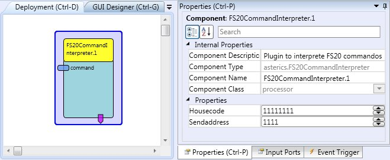

# FS20CommandInterpreter

Component Type: Processor (Subcategory: Home Control)

The FS20CommandInterpreter receives strings containing commands of the home automation system FS20 for ELV Electronics. Depending on the received commands, events will be fired.

FS20CommandInterpreter Plugin

## Input Port Description

- **command \[string\]:** The command string containing the FS20 Command. The data must have the following format: housecode_sendaddress_command, e.g. 11111111_3343_17

## Event Trigger Description

Each received command triggers an event, being mapped to this command. The following table will describe this events:

Command Mapping

Event

Command

Off

0

Level1

1

Level2

2

Level3

3

Level4

4

Level5

5

Level6

6

Level7

7

Level8

8

Level9

9

Level10

10

Level11

11

Level12

12

Level13

13

Level14

14

Level15

15

Level16

16

OnOldLevel

17

Toggle

18

Dim Up

19

Dim Down

20

Dim Up and Down

21

Program internal timer

22

Off for timer then old brightness level

24

On for timer then off

25

On old brightness level for timer then off

26

On for timer then old brightness level

30

On for old level then previous state

31

## Properties

- **housecode \[integer\]** The housecode, the plugin should react on. The housecode has 8 digits, each from 1 to 4.
- **sendaddress \[integer\]** The sendaddress, the plugin should react on. The sendaddress has 4 digits, each from 1 to 4.
