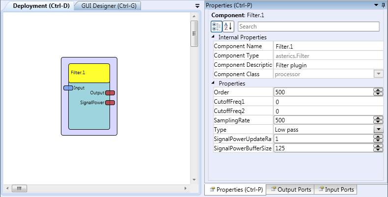

# Filter

Component Type: Processor (Subcategory: DSP and Feature Detection)

This plugin implements a FIR Filter

Filter plugin

## Input Port Description

- **Input \[double\]:** The signal to be filtered.

## Output Port Description

- **Output \[double\]:** The filtered signal.
- **SignalPower \[double\]:** Signal Power on the band pass.

## Properties

- **Order \[integer\]:** Order of the filter. It is recommended to use orders around the sampling rate.

- **CutoffFreq1 \[double\]:** Cutoff frequecy for low and high pass filter types. In case of band pass filters it is the low cutoff frequency of the band.

- **CutoffFreq2 \[double\]:** In case of band pass filters it is the high cutoff frequency of the band.

- **SamplingRate \[integer\]:** Sampling rate of the input signal.

- **Type \[integer\]:** Type of filter (low, high or band pass filter).

- **SignalPowerUpdateRate \[integer\]:** Update ratio for the SignalPower output port. The SignalPower output port provides a new value every time the Output port has provided N values, where N is the value of this property.

- **SignalPowerBufferSize \[integer\]:** Length of the buffer that keeps the filtered signal that is used to compute the power of the signal.
