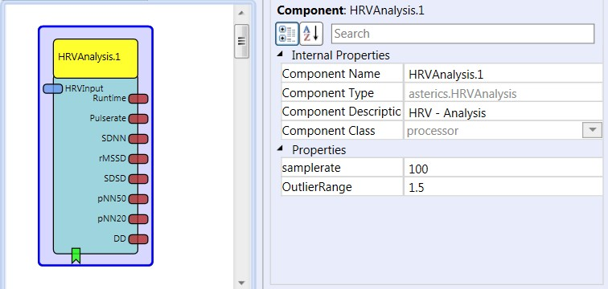

##

## HRVAnalysis

# HRVAnalysis

### Component Type: Processor (Subcategory: DSP and feature extraction)

This component calculates various Heart Rate Variability (HRV) parameters from an incoming signal of raw ECG-data. For a detailed description of the HRV parameters and a guide how to use optical and electrical heart rate sensors see the work of Andreas Schreiber (in /documentation/DIYGuides/HRVAnalysis_Schreiber.pdf and /documentation/OpticalPulseSensor_Schreiber.pdf)

  
HRVAnalysis plugin

## Input Port Description

- **HRVInput \[double\]:** Input port for the raw signal

## Output Port description

- **runtime \[double\]:** the current time, since the first sample, in seconds
- **pulserate \[double\]:** the current calculated pulserate
- **SDNN \[double\]:** the standard deviation of all RR-intervals
- **rMSSD \[double\]:** the square-root of the average sum of the quadratic differences between neighboring RR-intervals
- **SDSD \[double\]:** the current standard deviation of successive differences between neighbouring RR-intervals
- **pNN50 \[double\]:** the numer of successive RR-intervales that differ by more than 50ms (expressed as percentage of all RR-intervals)
- **pNN20 \[double\]:** the numer of successive RR-intervales that differ by more than 20ms (expressed as percentage of all RR-intervals)
- **DD \[double\]:** the deviation of 2 succesive RR-intervals

## Event Listener Description

- **start:** An incoming event starts the HRV analysis

## Properties

- **samplerate \[double\]:** specifies the sample rate of the incoming signal.
- **outlierRange \[double\]:** Defines factor of the mean R-amplitudes which is used as a threshold to detect spikes / signal artefacts.
