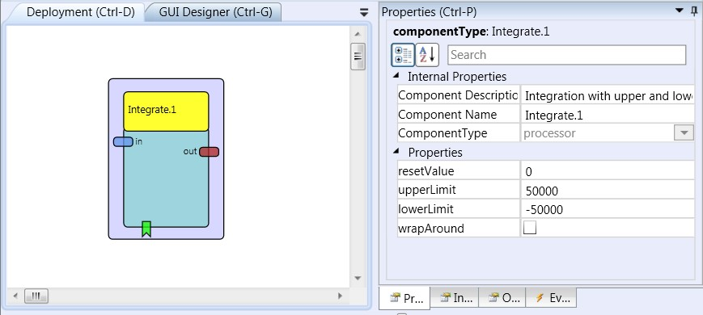

# Integrate

Component Type: Processor (Subcategory: Basic Math)

The integrate component performs successive addition of incoming signal values. This is useful for transforming relative movement information coming from a sensor into absolute position values.

Integrate plugin

## Input Port Description

- **in \[double\]:** The input port for signal values.

## Output Port Description

- **out \[double\]:** Output of the integrated values.

## Event Listener Description

- **reset:** An incoming event at this port sets the current accumulator value to the rest value (specified in the rest property field).

## Properties

- **resetValue \[double\]:** The initial value of the accumulator, which is set when starting the model or when an event comes in at the elp_rest event listener port.
- **upperLimit \[double\]:** The maximum accumulator value (the integration sum will stay at this value and not get higher even if positive values come in at the input port).
- **lowerLimit \[double\]:** The minimum accumulator value (the integration sum will stay at this value and not get lower even if negative values come in at the input port) Upper and lower limit are useful e.g. to set bounds for mouse movement etc.
- **wrapAround \[boolean\]:** If this property is set to true, the accumulator value is set to the lower_limit if it gets greater than the upper_limit (overflow), and to the upper_limit if it would get lower than the lower_limit (underflow).
