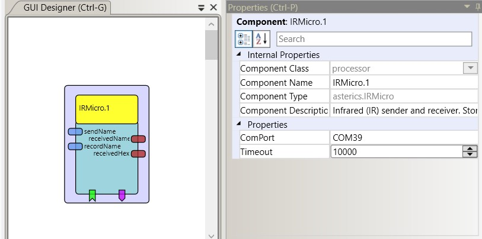

# IrMicro

## Component Type: Processor (Subcategory: Home Control)

The IRMicro plugin connects to a Microcontroller via a COM port in order to receive and sent infrared (IR-) remote control commands (raw timing values).
The values are stored in (or loded from) .csv file (one file per command, given the command's name as `filename.csv`) in the ARE subfolder `./data/processor.IRMicro`.

## Requirements

A connection to a microcontroller running the IrMicro firmware is required.
The IrMicro firmware is provided in folder `/CIMS/IrMicro`.
This firmware is an Arduino Sketch for record/replay of infrared commands.
Connect a TSOP module (e.g. TSOP4838) to pin 11 and an IR led with current-limiting resistor to send pin of a compatible microcontroller (for examle pin 3 for the Arduino Uno).
For a list of compatible controllers and default send pins see: [IR-Remote Github repository][1].

## Input Port Description

- **sendName\[string\]:** A string which contains a known command name. The existing (recorded) commands are stored in .csv files in the folder `ARE/data/processor.IRMicro`. If the command file is found, the stored timing codes are replayed by the connected microcontroller

- **recordName\[string\]:** A string which contains the name of a command which shall be recorded. The microcontroller is put into recording mode and waits (until a given timeout) for an IR code to be received via the TSOP module. After a command has been recorded, the codes are stored in a .csv file (filename is the command name) in the folder `ARE/data/processor.IRMicro`.

## Output Port Description

- **receivedName\[string\]:** If a known IR command has been received via the microcontroller's TSOP module, the command name is put out on this port as a string
- **receivedHex\[string\]:** The timing values of a known or unknown command are sent to this output port as a string

## Event Listener Description

- **clearAll:** all stored IR-commands are cleared.
- **clearLast:** the last recorded IR-command is cleared.

## Event Trigger Description

- **recordFinished:** a new command was recorded successfully.
- **recordTimeout:** the timeout value was reched when trying to record a new command.

## Properties

- **ComPort\[string\]:** The name of the Comunication port which shall be opened in order to communicte with the microcontroller.
- **Timeout\[integer\]:** The timeout for recording a new IR-command (in milliseconds).

[1]: https://github.com/z3t0/Arduino-IRremote
