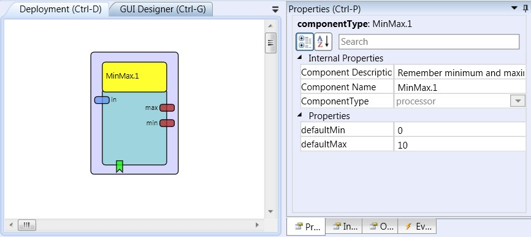

# MinMax

Component Type: Processor (Subcategory: Basic Math)

This component stores maximum and minimum of an incoming signal and provides these values at the output ports. Together with the signaltranslation component, the minmax component can be used to auto-scale input values to a desired signal range.

MinMax plugin

## Input Port Description

- **in \[double\]:** Input signal for min/max calculation.

## Output Port Description

- **outMax \[double\]:** The current maximum value found in the signal.
- **outMin \[double\]:** The current minimum value found in the signal.

## Event Listener Description

- **reset:** An incoming event sets the current minimum and maximum to the values defined in the associated property fields defaultMin and defaultMax.

## Properties

- **defaultMin \[double\]:** This is the default minimum value which is set when the model is started or if an event comes in at the rest event listener port.
- **defaultMax \[double\]:** This is the default maximum value which is set when the model is started or if an event comes in at the reset event listener port.
