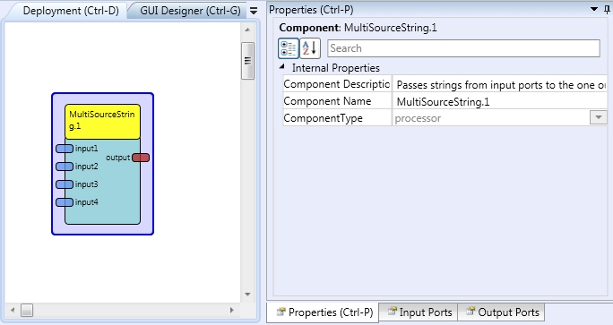

# MultiSourceString

Component Type: Processor (Subcategory: Signal Pathways)

This plugin passes string inputs from up to four input ports to one output port.

MultiSourceString plugin

## Input Port Description

*   **input1...input4 \[string\]:** Input ports 1 to 4.

## Output Port Description

*   **output \[****string****\]:** Output port.