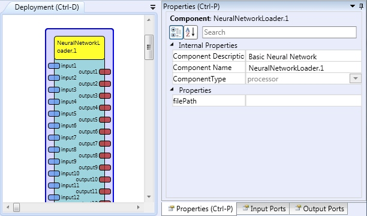

# Neural Network Loader

## Component Type: Processor (Subcategory: DSP and Feature Detection)

This plugin uses the [Encog framework][1] (version: 3.0.1). The plugin can load a neural network configuration stored in the Encog EG file. The neural network‘s output is calculated for the input data.

NeuralNetworkLoader plugin

## Input Port Description

- **input1...input32 \[double\]:** The Neural network inputs.

## Output Port Description

- **output1...output32 \[\*\***double\***\*\]:** The Neural network outputs.

## Properties

- **filePath \[string\]:** The EG file path.

[How to prepare example EG file for the Neural Network Loader plugin.][2]

[1]: http://www.heatonresearch.com/encog
[2]: eg_example.htm
