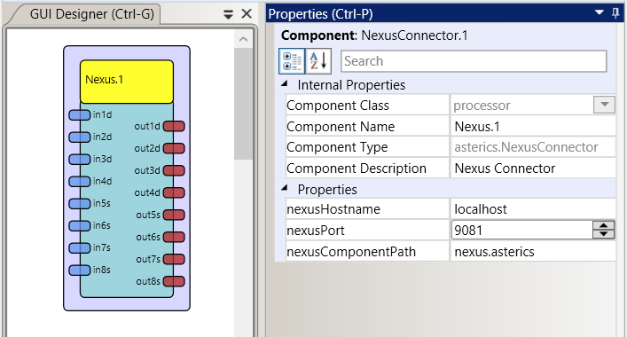

# NexusConnector

Component Type: Processors (Subcategory: Web)

The NexusConnector component provides a bidirectional connection to a GPII Nexus instance.



NexusConnector plugin

## Requirements

The NexusConnector component requres a running GPII Nexus instance to connect to and a peer component constructed within the Nexus for the connector to bind to. The Nexus instance is run and managed separately from this component and AsTeRICS. Please see the "Properties" section below for details on specifying the address of the Nexus instance to connect to.

The NexusConnector component expects the peer component within the Nexus to have a model of the following structure:

```

		{
			connector: {
				inputs: {
					in1d: <double value>,
					in2d: <double value>,
					in3d: <double value>,
					in4d: <double value>,
					in5s: <string value>,
					in6s: <string value>,
					in7s: <string value>,
					in8s: <string value>
				},
				outputs: {
					out1d: <double value>,
					out2d: <double value>,
					out3d: <double value>,
					out4d: <double value>,
					out5s: <string value>,
					out6s: <string value>,
					out7s: <string value>,
					out8s: <string value>
				}
			}
		}
```

## Input Port Description

The NexusConnector component has 8 generic input ports. Four each of type double and string. When a value on one of the inputs changes, that change is relayed to the Nexus and the model of the bound component is updated.

*   **in1d \[double\]:** Sent to the Nexus
*   **in2d \[double\]:** Sent to the Nexus
*   **in3d \[double\]:** Sent to the Nexus
*   **in4d \[double\]:** Sent to the Nexus
*   **in5s \[string\]:** Sent to the Nexus
*   **in6s \[string\]:** Sent to the Nexus
*   **in7s \[string\]:** Sent to the Nexus
*   **in8s \[string\]:** Sent to the Nexus

## Output Port Description

The NexusConnector component has 8 generic output ports. Four each of type double and string. When a value, or values, change within the "outputs" section of the peer component in the Nexus, that change is relayed to the NexusConnector and the value on the NexusConnector output ports are updated accordingly.

*   **out1d \[double\]:** Received from the Nexus
*   **out2d \[double\]:** Received from the Nexus
*   **out3d \[double\]:** Received from the Nexus
*   **out4d \[double\]:** Received from the Nexus
*   **out5s \[string\]:** Received from the Nexus
*   **out6s \[string\]:** Received from the Nexus
*   **out7s \[string\]:** Received from the Nexus
*   **out8s \[string\]:** Received from the Nexus

## Properties

*   **nexusHostname \[string\]:** The address of the machine on which the Nexus is running
*   **nexusPort \[integer\]:** The port number on which the Nexus is listening
*   **nexusComponentPath \[string\]:** The path of the peer component to bind to within the Nexus