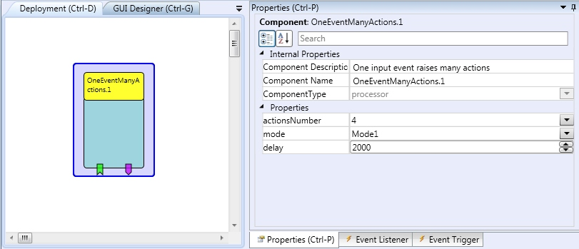

# One Event Many Actions

## Component Type: Processor (Subcategory: Event and String Processing)

This component allows the user to control up to 10 actions using just one or two input events. In the first step, the event actions are scanned so that the user can choose the action, in the next step the selected action event is triggered. The detailed functionality depends upon the selected mode.

OneEventManyActions plugin

## Event Listener Description

- **input:** The control event.

- **inputOff:** Control event used in mode 2 for selecting the action by scanning.

## Event Trigger Description

- **action1...action10\*\***:\*\* The event triggers for the actions selected by user.

- **actionShown11...actionShown110\*\***:\*\* These events are used in the scanning process to highlight the currently selected action via a GUI element (e.g. the CellBoard).

## Properties

- **actionsNumber \[integer\]:** Number of action used.

- **mode \[integer\]:** The component's working mode:

  - **mode 1:** The input event starts the scanning, the inputOff event selects the action.

  - **mode 2:** The first input event starts the scanning, the second input event selects the action.

  - **mode 3:** The first input event starts the scanning and highlights the first action, the next input events highlight the next actions. If there is no input event for the selected delay time, the currently highlighted action is selected.

- **delay \[integer\]:** Delay used for the scanning process (in milliseconds).
