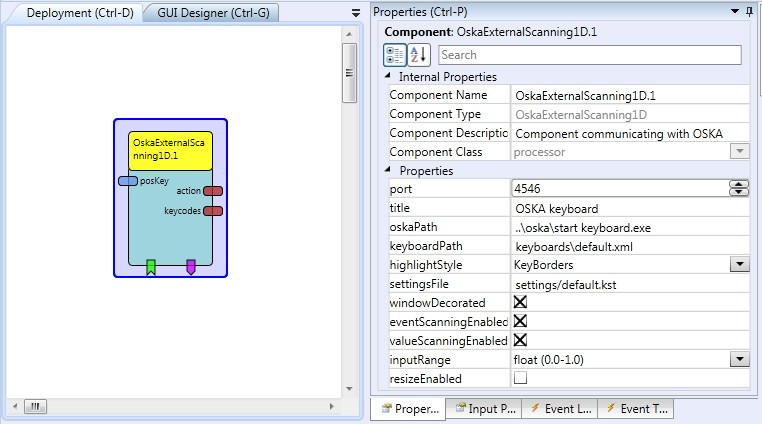

##

## OskaExternalScanning1D

# OskaExternalScanning1D

### Component Type: Processor (Subcategory: OSKA)

This component interacts with the On Screen Keyboard Application (OSKA) and forwards key selections and command (action-) strings to other ARE plugins. The scanning function of OSKA can be controlled via this plugin, allowing 1-dimensional input values to be used for direct scanning position selection. This is done in a two-step fashion where first the columns are highlighted and then keys of a column are highlighted. Selection of columns and cells is performed upon incoming events. The event input ports allow switching from row- to column scanning, moving the cell highlighter and selecting a cell.

  
OskaExternalScanning1D plugin

## Requirements

This component requires Sensory Software's OSKA keyboard. OSKA is automatically started by the plugin if it is located in the expected path ("../OSKA/Start Keyboard.exe").

## Input Port Description

- **posKey \[double\]:** This port takes values for the selection of keys (respectively columns). Depending on the value of the property "inputRange", the incoming values are expected to be in a range from 0 to 1 (where 0 represents the first selection and 1 the last) or they identifiy the absolute key/column position as integer values. The input moves either the highlighted column or the highlighted key in the selected column to the corresponding position. A selection of the currently highlighted item can be triggered by incoming events.

## Output Port Description

- **action \[string\]:** This output sends the action strings (which have been added to a key in the OSKA editor) when this key is pressed.
- **keycodes \[string\]:** If a key is selected which contains the "@KDB: ..." action string, the key codes are extracted from the action string and sent via this port, e.g. to the remoteKeyboard plugin's corresponding input port for keyboard input emulation.

## Event Listener Description

- **switch:** Incoming events will trigger a state change in the scanning state machine. On the first press highlighting will switch from column highlighting to cell highlighting. On the second press, the currently highlighted OSKA cell will be selected.
- **highlightNext:** Incoming events highlight the next column (or cell in a column).
- **highlightPrev:** Incoming events highlight the previous column (or cell in a column).

## Event Trigger Description

- **eventOut1-eventOut10:** These events can be triggered by selecting a cell which contains an @OSKA,event .. action string, (for example @OSKA,event 3).

## Properties

- **port \[integer\]:** This property defines the TCP port that the component listens on for connections of the OSKA.
- **title \[string\]:** This property defines the caption to be displayed in OSKA?s title bar.
- **oskaPath \[string\]:** The absolute path to the OSKA player as well as the program name is needed in order for the component to start OSKA by itself.
- **keyboardPath \[string\]:** If this property does not hold an empty string, the component will ask OSKA to load the keyboard referred to by this property. When the ACS is synchronized with the ARE (connected and model deployed) available keyboards can be selected from a drop-down listbox. (dynamic property)
- **highlightStyle \[integer\]:** This property selects the style of highlighting used in OSKA, the value range is from 0 to 2.
- **settingsFile \[string\]:** if this property is not empty OSKA will be started with this settings file as a command line parameter. When the ACS is synchronized with the ARE (connected and model deployed) available settings files can be selected from a drop-down listbox **Supports value suggestions from ARE (dynamic property)**
  **\* **windowDecorated \[boolean\]:\*\* if true, Oska will display a decorated window frame, otherwise only a lightweight frame.
- **eventScanningEnabled \[boolean\]:** if true, incoming events can move the highlighter.
- **valueScanningEnabled \[boolean\]:** if true, incoming values can move the highlighter.
- **inputRange \[boolean\] (combobox):** the range of the incoming input port values: either float values between 0 and 1, or integer values or integer values from 0 to the maximum element (number of cells in a respective row or column of the grid).
- **resizeEnabled \[boolean\]:** if true, the Oska will be resized to the dimensions specified in the GUI designer (slower).\*\*
