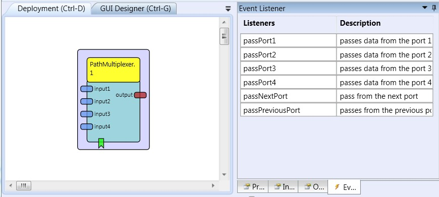

# Path Multiplexer

### Component Type: Processor (Subcategory: Signal Pathways)

The Path Multiplexer component forwards signal from the selected input port to the output port.

  
PathMultiplexer plugin

## Input Port Description

- **input1 to input4 \[double\]:** The input ports for signals to be multiplexed 1..4.

## Output Port Description

- **output** **\[double\]\*\***:\*\* The output port.

## Event Listener Description

- **passPort1 to passPort4:** The event send to this port sets the forwarding signal from the appropriate input port:1...4 to the output port.

- **passNextPort:** The event send to this port sets the forwarding signal from the next input port. If the current used is the port defined by the number property, the signal will be forward from the input port 1.

- **passPreviousPort:** The event send to this port sets the forwarding signal from the previous input port. If the current used is the port 1, the signal will be forward from the input port defined by the number property.

## Properties

- **number \[integer\]:** The maximum port number in use (can be 1 to 4).
