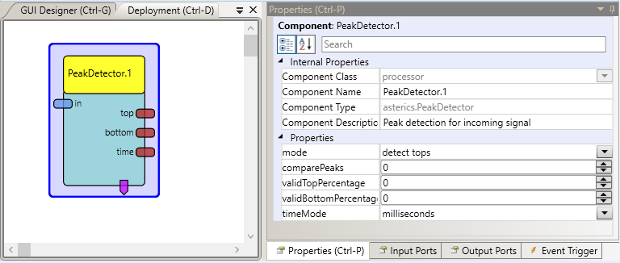

# PeakDetector

Component Type: Processor (Subcategory: Basic Math)

The Peakdetector component can be used to detect peaks (top values of the signal) and valleys (bottom values) in a signal. Additionally it can calculate the time between two peaks or two valleys or between a peak and a valley. Optionally, top and bottom values can be compared with an average of the most recent top / bottom values - this allows to detect only peaks which are for example greater than 150% of the last 5 averaged peak values.

PeakDetector plugin

## Input Port Description

*   **in \[double\]:** The incoming signal.

## Output Port Description

*   **top:** The peak value of the signal.
*   **bottom:** The bottom value of the signal.
*   **time:** The time in ms or beats per minute (BPM) (depending on the property timeMode) between two peaks (Mode=detect tops), two valleys (Mode=detect bottoms) or a valley and a peak (Mode=detect both) depending on the selected mode in the properties.

## Event Trigger Description

*   **topDetected:** The event gets fired if a new top value was detected in the input signal.
*   **bottomDetected:** The event gets fired if a new bottom value was detected in the input signal.

## Properties

*   **mode:** Determines which time frame will be used for the time output signal (see description of the output port time).
*   **comparePeaks:**the number of top / bottom values which are taken into account for averaging (0 = disable)
*   **validTopPercentage:**the percentage of the recent averaged top values which constitutes a valid top value (0 = all top values are valid)
*   **validBottomPercentage:**the percentage of the recent averaged bottom values which constitutes a valid bottom value (0 = all bottom values are valid)
*   **timeMode:** Determines the unit for the measured time frame between top/bottom values. Options are beats per minute (BPM) or milliseconds.