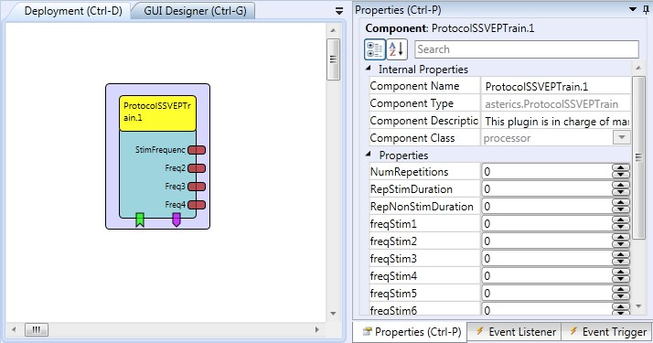

# Protocol SSVEP Train

Component Type: Processor (Subcategory: DSP and Feauture extraction) This component is in charge of managing and configuring the SSVEP training recording protocol. It sends out the corresponding SSVEP stimulation frequencies.

ProtocolSSVEPTrain plugin

## Requirements

This plugins must be connected to the FlickeringLightStimulator plugin (which triggers the external SSVEP stimulation panels) or to the SSVEPStiumlator plugin.

## Output Port Description

*   **StimFrequency \[integer\]:** Current stimulation frequency in Hz under test.
*   **Freq2 \[integer\]:** Background stimulation frequency in Hz for panel 2.
*   **Freq3 \[integer\]:** Background Stimulation frequency in Hz for panel 3.
*   **Freq4 \[integer\]:** Background Stimulation frequency in Hz for panel 4.

## Event Listener Description

*   **StartProt:** Start protocol request.
*   **StopProt:** Stop protocol request.
*   **Continue:** Next Stimulation trial request
*   **Repeat:** Repeat last stimulation trial request.
*   **Stop:** Abort current stimulation trial request.

## Event Trigger Description

*   **StartTrial:** Event sent when a stimulation trial starts.
*   **StopTrial:** Event sent when a stimulation trial ends.
*   **StartStim:** Event sent when a stimulation period starts.
*   **StopStim:** Event sent when a stimulation period ends.
*   **ReadyStim:** EEvent sent 1 second befor the stimulation periods starts.
*   **UpdatePanelConfig:** Event sent requesting a stimulation panels re-configuration.

## Properties

*   **NumRepetitions \[integer\]:** Number of stimulation periods per trial.
*   **RepStimDuration \[integer\]:** Stimulation period duration in seconds.
*   **RepNonStimDuration \[integer\]:** Non-Stimulation period duration in seconds.
*   **freqStim1 \[integer\]:** Stimulation frequency number 1 in Hz.
*   **freqStim2 \[integer\]:** Stimulation frequency number 2 in Hz.
*   **freqStim3 \[integer\]:** Stimulation frequency number 3 in Hz.
*   **freqStim4 \[integer\]:** Stimulation frequency number 4 in Hz.
*   **freqStim5 \[integer\]:** Stimulation frequency number 5 in Hz.
*   **freqStim6 \[integer\]:** Stimulation frequency number 6 in Hz.
*   **freqStim7 \[integer\]:** Stimulation frequency number 7 in Hz.
*   **freqStim8 \[integer\]:** Stimulation frequency number 8 in Hz.
*   **freqStim9 \[integer\]:** Stimulation frequency number 9 in Hz.
*   **freqStim10 \[integer\]:** Stimulation frequency number 10 in Hz.
*   **RandomizeFreq \[boolean\]:** Randomize stimulation frequencies order.