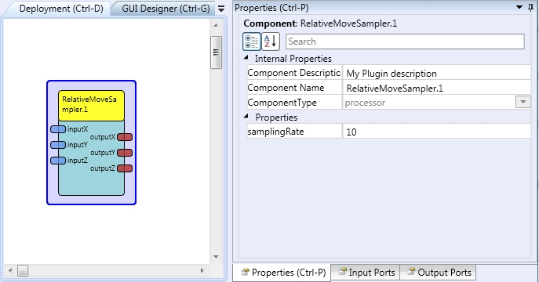

# Relative Move Sampler

### Component Type: Processor (Subcategory: Basic Math)

This plugin was developed for models where a constant rate of value updates is needed. The plugin sums incoming relative position packages for three coordinates. The sums are sent to the output ports according to sampling rate. When the sums are sent, the accumulation values are reset to zero.

  
Relative Move Sampler

## Input Port Description

- **inputX \[integer\]:** Input X position.
- **inputY \[integer\]:** Input Y position.
- **inputZ \[integer\]:** Input Z position.

## Output Port Description

- **outputX \[\*\***integer\***\*\]:** Output X position.
- **outputY \[\*\***integer\***\*\]:** Output Y position.
- **outputZ \[\*\***integer\***\*\]:** Output Z position.

## Properties

- **samplingRate \[integer\]:** Defines the rate of the sampling (in Hz).
