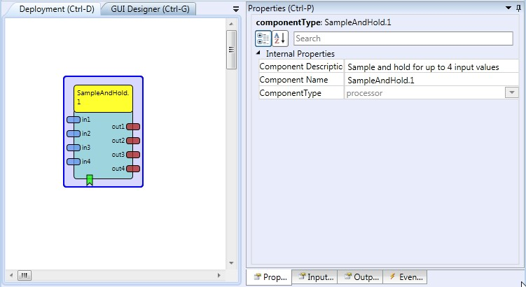

# Sample and Hold

Component Type: Processor (Subcategory: Basic Math)

This component provides a sample-and-hold function for up to 4 input signals. This can be useful for storing a particular sensor values (e.g. for sensor calibration purpose).

SampleAndHold plugin

## Input Port Description

- **in1 - in4 \[double\]:** four input ports for double values to be captured on demand.

## Output Port Description

- **out1 - out4 \[double\]:** last captured values.

## Event Listener Description

- **sampleNow:** When an event comes in, the signal values of the input ports are captured and sent to the output ports.
