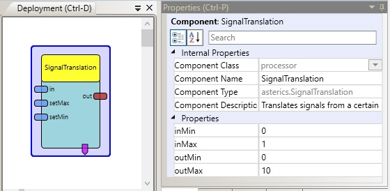

# Signal Translation

Component Type: Processor (Subcategory: Signal Shaping)

The signal translation component is used to translate an input value which resides in a certain value range to a given output range. Interpolation of the position in the output range is done linearly. The component provides two inputs which allow other components to set the minimum and maximum value of the input range.

SignalTranslation plugin

## Input Port Description

- **in \[double\]:** This port receives the input values which will be translated to the new range.
- **setMax \[double\]:** This port sets the value of the input maximum property (inMax) in the component.
- **setMin \[double\]:** This port sets the value of the input minimum property (inMin) in the component.

## Output Port Description

- **out \[double\]:** This port sends the translated values corresponding to the output range.

## Event Trigger Description

- **enterRange:** This event is generated if the defined input range was entered by the last input value and now inMin < value < inMax holds. It is also fired if inMin or inMax is changed using the corresponding input ports and after this change now inMin < value < inMax newly holds.
- **exitRangeBelow:** This event is generated if value < inMin holds and value >= inMin was true for the last value. It is also fired if inMin is changed using the corresponding input port and after this change value < inMin newly holds.
- **exitRangeAbove:** This event is generated if value > inMax holds and value <= inMax was true for the last value. It is also fired if inMax is changed using the corresponding input port and after this change value > inMax newly holds.

## Properties

- **inMin \[double\]:** Sets the minimum value of the input range, input values below this value will be clipped to the minimum.
- **inMax \[double\]:** Sets the maximum value of the input range, input values above this value will be clipped to the maximum.
- **outMin \[double\]:** Sets the minimum value of the output range.
- **outMax \[double\]:** Sets the maximum value of the output range.
