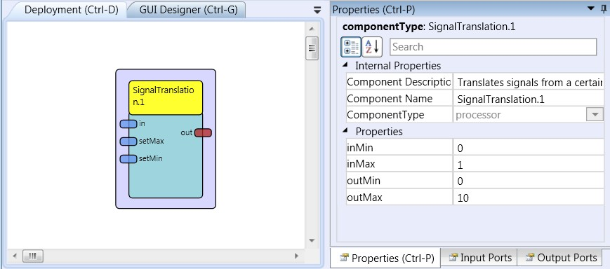

# Signal Translation

### Component Type: Processor (Subcategory: Signal Shaping)

The signal translation component is used to translate an input value which resides in a certain value range to a given output range. Interpolation of the position in the output range is done linearly. The component provides two inputs which allow other components to set the minimum and maximum value of the input range.

  
SignalTranslation plugin

## Input Port Description

- **in \[double\]:** This port receives the input values which will be translated to the new range.
- **setMax \[double\]:** This port sets the value of the maximum property in the component.
- **setMin \[double\]:** This port sets the value of the minimum property in the component.

## Output Port Description

- **out \[double\]:** This port sends the translated values corresponding to the output range.

## Properties

- **inMin \[double\]:** Sets the minimum value of the input range, input values below this value will be clipped to the minimum.
- **inMax \[double\]:** Sets the maximum value of the input range, input values above this value will be clipped to the maximum.
- **outMin \[double\]:** Sets the minimum value of the output range.
- **outMax \[double\]:** Sets the maximum value of the output range.
