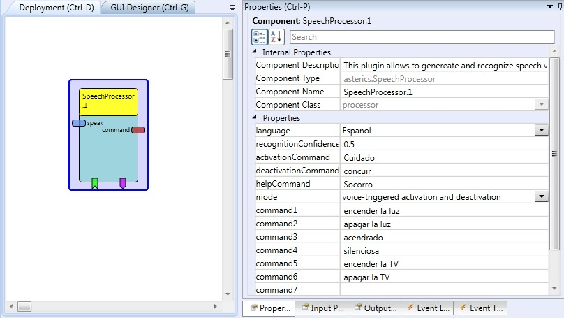

# Speech Processor

Component Type: Processor (Subcategory: Audio and Voice)

The SpeechProcessor component provides methods to use a speech recognition engine and a speech synthesizer, provided via the Microsoft Speech Platform Server version 11 (see [http://www.microsoft.com/en-us/download/details.aspx?id=27225](http://www.microsoft.com/en-us/download/details.aspx?id=27225)). The Microsoft Speech Platform provides enables recognition of spoken words and generation of synthesized speech (text-to-speech, TTS). Engines and language packs for 26 languages can be downloaded for free (see above link). The language (culture) of speech recognition and synthesis can be adjusted as a plugin property (currently English, German, Spanish and Polish are supported by the plugin, if the language packs are installed.) The supported voice commands can be set by the plugin properties. Recognized commands trigger events and are put to an output port as stings. Moreover, the component can receive strings which are spoken via the selected speech synthesizer. The component features special commands for activation, deactivation and speaking all supported commands

SpeechProcessor plugin

## Requirements

- This component requires Microsoft's Speech Platform version 11 Runtime and the desired language packs to be installed on the platform running the plugin.

## Input Port Description

- **speak \[string\]:** This port receives strings containing sentences or words that should be spoken via a speech synthesizer which fits the selected language (text-to-speech).

## Output Port Description

- **command \[string\]:** This output sends strings which have been recognized by the speech recognition engine (matching one of the commands defined by property values).

## Event Listener Description:

- **help:** and incoming event starts the help mode where all supported voice commands will be spoken.

## Event Triggerer Description:

- **activated:** triggered when the recognition is activated via the defined activation command.
- **deActivated:** triggered when the recognition is deactivated via the defined command.
- **recognizedCommand1 - recognizedCommand10:** If an incoming word matches a command defined in the plugin properties, the corresponding event will fire.

## Properties

- **language \[integer\] (combobox selection):** A combobox which defines which speech pack is to be used (currently: English, German, Spanish, Polish) - these language packs need to be installed !
- **recognitionConfidence \[double\]:** This value defines the needed confidence for a valid recognition. The value can range from 0 to 1. A higher value results in a more precise pronunciation needed to detect a command, a lower level could lead to more false-positive recognition results.
- **speechLoopDelay \[integer\]:** This value defines the minimal time between two speech commands. It is used to avoid recognition-loops
- **activationCommand \[string\]:** a speech command to start the recognition of the other commands.
- **deactivationCommand \[string\]:** a speech command to stop the recognition of the other commands.
- **helpCommand \[string\]:** a speech command to speak out all supported voice commands.
- **mode \[integer\] (combobox selection):** This property selects one out of three operating modes for the speech recognition:
  - "always active": the command recognition is always running
  - "voice-triggered activation and deactivation": the command recognition is started by the recognition of the activation command and stopped by the deactivation command (these commands are defined in the according properties).
  - "automatic deactivation after command recognition": after a recognized command, the speech recognition will be bypassed until another activation command has been recognized.
  - "speech recognition disabled (TTS only)": In this mode, the speech recognition engine is not used whichs saved CPU power in text-to-speech-only applications.
- **command1 to command10:** The command strings which are checked by the speech recognition engines (these build the recognition grammar).
