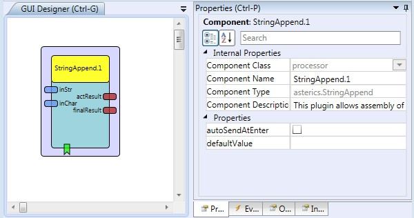

# String Append

Component Type: Processor (Subcategory: Event and String Processing)

Appends an incoming string or ASCII character to a stringbuffer, the updated stringbuffer is sent to an output port. Incoming events are available to send the final string to a dedicated output port and to clear the stringbuffer (or set it to a default value respectively).

StringAppend plugin

## Input Port Description

- **inStr \[string\]:** String input port.
- **inChar \[integer\]:** ASCII code input port.

## Output Port Description

- **actResult \[string\]:** String output port for current stringbuffer content.
- **finalResult \[string\]:** String output port for final stringbuffer content (triggered by event or enter).

## Event Listener Ports

- **sendNow:** sends the current content of the stringbuffer to the "finalResult" output port.
- **sendNowAndClear:** sends the current content of the stringbuffer to the "finalResult" output port and sets the stringbuffer to the default value.
- **deleteCharacter:** deletes the last character of the stringbuffer.
- **clear:** sets the stringbuffer to the default value.

## Properties

- **autoSendAtEnter \[boolean\]:** If true, the stringbuffer is sent and cleared when the ASCII value for Enter/Return is received by the inChar input port.

- **defaultValue \[string\]:** An optional string text which is used a initial value for the stringbuffer.
