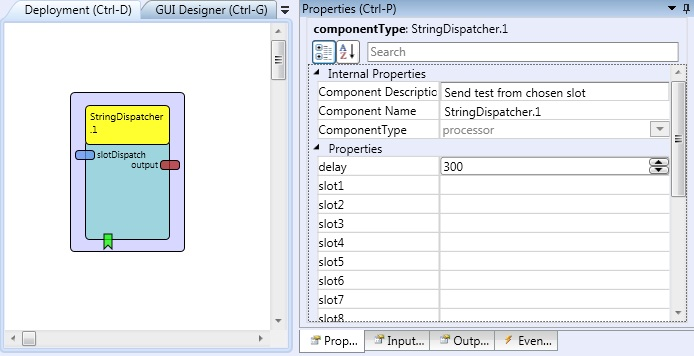

# String Dispatcher

### Component Type: Processor (Subcategory: Event and String Processing)

This component has twenty slots for text strings. These strings can be sent to the output port via incoming events or by directly addressing a slot number using the input port.

  
StringDispatcher plugin

## Input Port Description

- **slotDispatch \[integer\]:** Sends the string from the slot defined by number.

## Output Port Description

- **output \[string\]:** String output port.

## Event Listener Description

- **dispatchSlot1...dispatchSlot20:** These events cause text from the slot: 1..20 to be sent.
- **dispatchNextSlot:** This event causes text from the next (not empty) slot to be sent.
- **dispatchCurrentSlot:** This event causes text from the current slot to be sent.
- **dispatchPreviousSlot:** This event causes text from the previous (not empty) slot to be sent.
- **resetToFirstSlot:** This event resets the internal slot counter (for next/previous) to the first slot.
- **dispatchSlotSeries:** This event causes text in sequence from all not empty slots to be sent, with a delay defined by the delay property.

## Properties

- **delay \[integer\]:** The interval (in milliseconds) which will be used for sending strings sequentially from all slots.
- **slot1...slot20 \[string\]:** 20 slots which contains the text to be sent
