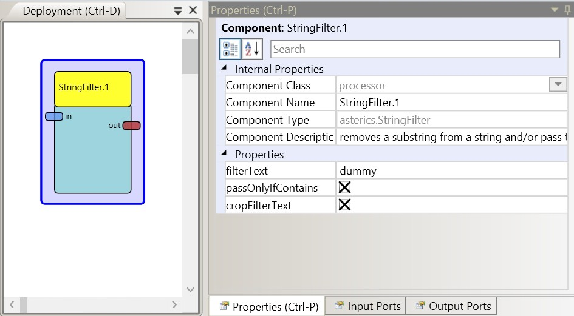

# String Filter

Component Type: Processor (Subcategory: Event and String Processing)

Applies a given filter text to the incoming string. It can be selected if only strings that contain the filter text are passed to the output port, and/or if the filter text shall be removed from the incoming string. Please note that the filter text is applied case sensitive.

StringFilter plugin

## Input Port Description

*   **in \[string\]:** String input port.

## Output Port Description

*   **out \[string\]:** String output port for processed/filtered string.

## Properties

*   **filterText \[string\]:** The filter text.  
    
*   **passOnlyIfContains \[boolean\]:** If selected, only strings containing the filter text will be passed.  
    
*   **cropFilterText \[boolean\]:** If selected, the filter will be removed before the input string is passed to the output port.