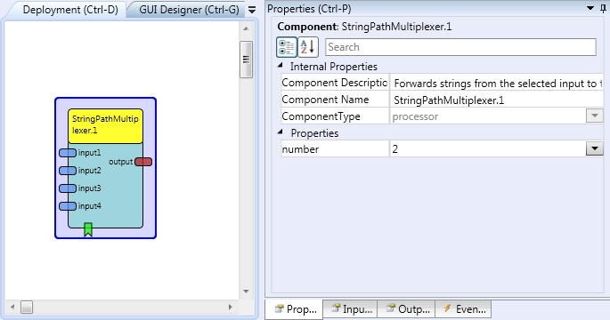

# {{$frontmatter.title}}

Component Type: Processor (Subcategory: Signal Pathways)

The String Path Multiplexer component forwards strings from the selected input port to the output port.

StringPathMultiplexer plugin

## Input Port Description

- **input1 to input4 \[string\]:** The input ports for strings to be multiplexed.

## Output Port Description

- **output** **\[string\]\*\***:\*\* The string output, which sends data of the selected input port.

## Event Listener Description

- **passPort1 to passPort4:** The string output, which sends data of the selected input port.

- **passNextPort:** selets the next input port. If the currently used port is the maximum port (defined by the number property), input port 1 will be selected.

- **passPreviousPort:** selects the previous input port. If the currently used port is port 1, the maximum port (defined by the number property) will be selected.

## Properties

- **number \[integer\]:** The maximum port number (can be 1 to 4).
