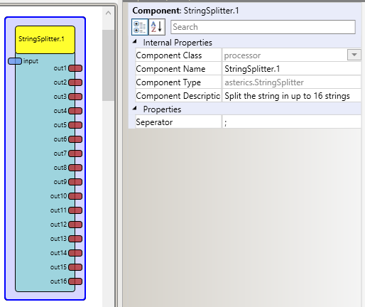

# String Splitter

### Component Type: Processor (Subcategory: Event and String Processing)

Splits a string with seperators in up to 16 outputports.

  
StringSplitter plugin

## Input Port Description

- **input \[string\]:** String input port. The string which has to be splitted.

## Output Port Description

- **output 1 to 16\[string\]:** String output ports. Sending the seperated Data.

## Properties

- **Seperator \[string\]:** Defines the seperator.
