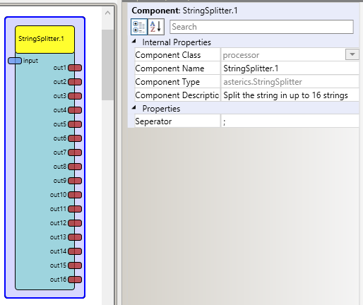

# String Splitter

Component Type: Processor (Subcategory: Event and String Processing)

Splits a string with separators in up to 16 outputports.

StringSplitter plugin

## Input Port Description

*   **input \[string\]:** String input port. The string which has to be splitted.

## Output Port Description

*   **output 1 to 16\[string\]:** String output ports. Sending the seperated Data.

## Properties

*   **Seperator \[string\]:** Defines the separator. The separator itself will not be part of the result strings. Please note that [regular expressions][1] can be use for the separator. This also means that special characters for the regular expressions are not allowed in the separator string, unless they are introduced with the escape character (backslash). These special characters are: the backslash \\\\, the caret ^, the dollar sign $, the period or dot ., the vertical bar or pipe symbol |, the question mark ?, the asterisk or star \*, the plus sign +, the opening parenthesis (, the closing parenthesis ), and the opening square bracket \[, the opening curly brace {. For example: for using the dot as separator, use \\. as separator string.  
    

[1]: https://docs.oracle.com/javase/8/docs/api/java/util/regex/Pattern.html#sum