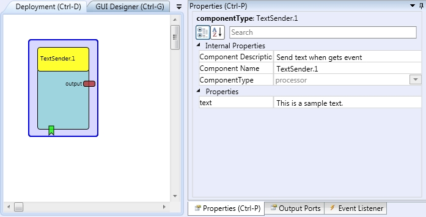

# Text Sender

Component Type: Processor (Subcategory: Event and String Processing)

This component sends the string data through the output port when it receives the trigger event.

TextSender plugin

## Input Port Description

*   **setText \[string\]:** Updates the text with the incoming string.

## Output Port Description

*   **output \[string\]:** String output port.

## Event Listener Description

*   **sendText:** This event causes text to be sent.

## Properties

*   **text \[string\]:** The default text to be sent.